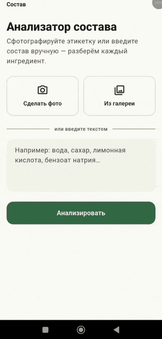
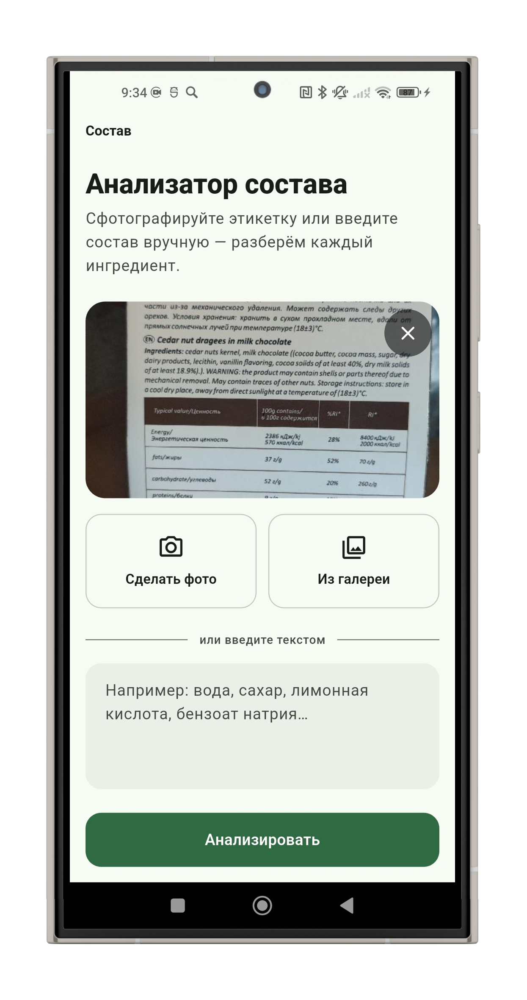
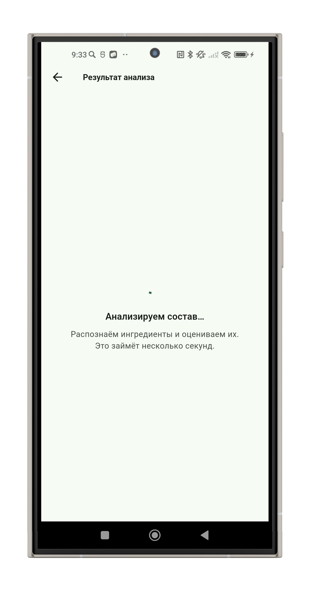
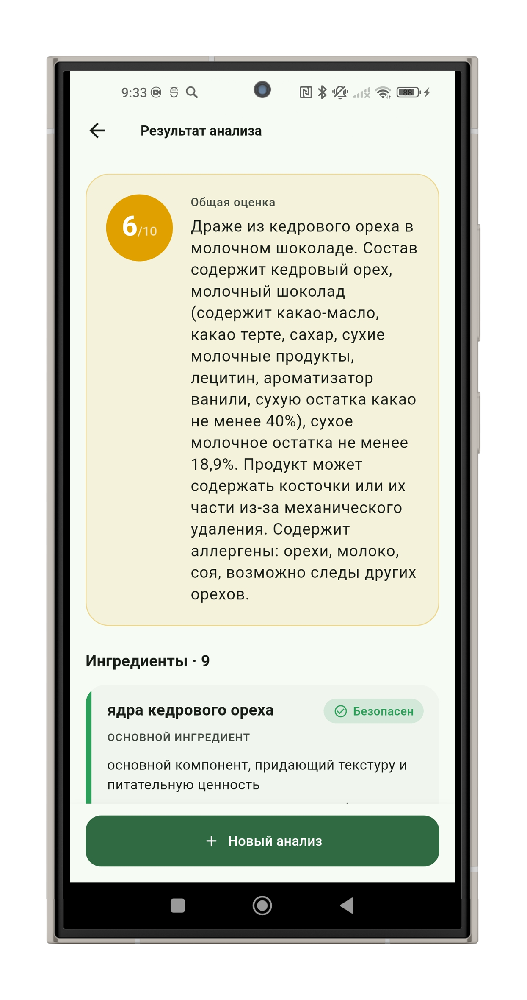

# Состав — анализатор состава продуктов

Flutter-приложение, которое разбирает состав продукта по фотографии этикетки
или введённому тексту. Данные отправляются в **LLM-провайдер** (сейчас —
**Qwen через Alibaba Bailian**, по OpenAI-совместимому API), который возвращает
строго структурированный JSON: общую оценку продукта и список ингредиентов с
категорией, назначением и уровнем внимания. Ингредиенты показываются карточками
с цветовой индикацией (🟢 безопасен · 🟡 есть нюансы · 🔴 стоит избегать).

<p align="center">
  
</p>

<!-- Положи GIF-демо в screenshots/demo.gif — блок выше подхватит её автоматически. -->

## Скриншоты

| Ввод | Загрузка | Результат |
|------|----------|-----------|
|  |  |  |

> Скриншоты лежат в папке `screenshots/` с именами `screenshot_input.png`,
> `screenshot_loading.png` и `screenshot_result.png`.

## Возможности

- 📷 Фото этикетки с камеры или из галереи + ручной ввод состава текстом
- 🤖 Разбор через мультимодальную модель (Qwen-VL) со **структурированным JSON**
- 🔌 Абстракция над провайдером: легко переключиться между Qwen и OpenAI
- 🎨 Material 3, светлая и тёмная темы, крупная типографика, мягкие тени
- 🧩 Карточки ингредиентов с цветной полосой уровня внимания
- 🛡️ Полная обработка ошибок: нет сети, таймаут, лимит (429), битый JSON, пустой ввод

## Запуск

Нужен API-ключ Alibaba Bailian / DashScope
(получить: <https://bailian.console.alibabacloud.com/>).
Ключ **не хранится в коде** — он передаётся при запуске через `--dart-define`:

```bash
flutter pub get

# запуск с провайдером по умолчанию (Qwen)
flutter run --dart-define=DASHSCOPE_API_KEY=ВАШ_КЛЮЧ

# сборка релиза (Android)
flutter build apk --dart-define=DASHSCOPE_API_KEY=ВАШ_КЛЮЧ
```

Все настраиваемые параметры сборки:

| dart-define | По умолчанию | Назначение |
|-------------|--------------|------------|
| `AI_PROVIDER` | `qwen` | Активный провайдер: `qwen` или `openai` |
| `DASHSCOPE_API_KEY` | — | Ключ Bailian (для Qwen) |
| `QWEN_MODEL` | `qwen3-vl-plus` | Vision-модель Qwen |
| `QWEN_BASE_URL` | `…dashscope-intl…/compatible-mode/v1` | Эндпоинт (Пекин: без `-intl`) |
| `QWEN_JSON_MODE` | `false` | Слать ли `response_format: json_object` |
| `AI_TIMEOUT_SECONDS` | `60` | Таймаут запроса к модели |
| `OPENAI_API_KEY` | — | Ключ OpenAI (если `AI_PROVIDER=openai`) |
| `OPENAI_MODEL` | `gpt-4o-mini` | Модель OpenAI |

Переключение на OpenAI:

```bash
flutter run --dart-define=AI_PROVIDER=openai --dart-define=OPENAI_API_KEY=ВАШ_КЛЮЧ
```

> Совет: чтобы не вводить ключ каждый раз, используйте файл
> `--dart-define-from-file=env.json` (не коммитьте его — он уже в `.gitignore`).

## Архитектура

Классическое разделение слоёв, состояние — на **Riverpod**.

```
lib/
├── main.dart                       # ProviderScope + Material 3 темы (light/dark)
├── config/
│   └── ai_config.dart              # выбор активного провайдера (сейчас Qwen)
├── models/
│   ├── ingredient.dart             # Ingredient + enum ConcernLevel (цвет/иконка/подпись)
│   └── analysis_result.dart        # AnalysisResult + защитный fromJson
├── services/
│   ├── ai_provider.dart            # abstract AiProvider + база OpenAI-совместимых + ошибки/схема
│   ├── qwen_provider.dart          # QwenProvider (Bailian, qwen3-vl-plus)
│   └── openai_provider.dart        # OpenAiProvider (альтернатива)
├── providers/
│   └── analysis_provider.dart      # AnalysisController → AsyncValue<AnalysisResult?>
├── screens/
│   ├── input_screen.dart           # ввод: фото/галерея/текст + валидация
│   └── result_screen.dart          # loading / data / error через state.when()
└── widgets/
    ├── ingredient_card.dart        # карточка с цветной полосой слева
    ├── loading_view.dart
    └── error_view.dart
```

**Поток данных.** `InputScreen` валидирует ввод и вызывает
`AnalysisController.analyze()`. Контроллер выставляет `AsyncLoading`, дёргает
активный `AiProvider.analyzeIngredients()` через `AsyncValue.guard` и кладёт
результат в `AsyncData` либо ошибку в `AsyncError`. `ResultScreen` подписан на
это состояние и рендерит нужный экран через `state.when(...)`.

### Абстракция над провайдером

```dart
abstract class AiProvider {
  String get name;
  bool get isConfigured;
  Future<AnalysisResult> analyzeIngredients({String? text, Uint8List? imageBytes, String mimeType});
}
```

Так как и Bailian (Qwen), и OpenAI используют один и тот же OpenAI-совместимый
формат `/chat/completions`, общая HTTP-логика вынесена в базовый
`OpenAiCompatibleProvider`, а `QwenProvider` / `OpenAiProvider` задают лишь
эндпоинт, ключ, модель и флаг JSON-режима. Активный провайдер выбирается в
`AiConfig` (`--dart-define=AI_PROVIDER=…`), по умолчанию — **Qwen**.

### Управление состоянием (Riverpod)

Три состояния UI — это три ветки одного `AsyncValue`:

- `AsyncData(null)` — простой (стартовый экран);
- `AsyncLoading` — идёт запрос → `LoadingView`;
- `AsyncData(result)` — готово → карточки;
- `AsyncError(e)` — ошибка → `ErrorView` (в `e` лежит типизированный `AiException`).

Контроллер помнит последний запрос, поэтому кнопка «Повторить» работает без
возврата на экран ввода.

## Как устроена работа со схемой ответа

Ключевая часть — заставить модель вернуть **строгий JSON**, а не свободный
текст. Ожидаемая схема:

```jsonc
{
  "product_summary": "строка",
  "overall_score": 7,               // целое 1..10
  "ingredients": [
    {
      "name": "Бензоат натрия",
      "category": "консервант",
      "purpose": "…",
      "concern_level": "moderate",  // "safe" | "moderate" | "avoid"
      "note": "…"
    }
  ]
}
```

Используется двухуровневый подход:

1. **Если провайдер поддерживает `response_format: {type: "json_object"}`**
   (OpenAI — да; Qwen-VL — включается флагом `QWEN_JSON_MODE`), он передаётся в
   запросе, и API гарантирует валидный JSON-объект.
2. **Иначе** формат задаётся в системном промпте (полная схема + требование
   «верни строго JSON, без markdown»), а ответ **валидируется при парсинге**:
   `extractJsonObject()` снимает markdown-фенсы ```` ```json ````, вырезает
   объект по фигурным скобкам и декодирует его.

Дальше JSON проходит через **защитный** `AnalysisResult.fromJson`: неверные
типы, отсутствующие поля и неизвестные значения `concern_level` не роняют
приложение (`overall_score` клампится в 1–10, неизвестный уровень → `moderate`).

Запрос мультимодальный: текст и/или изображение (base64 `data:`-URI в
`image_url`) отправляются в одном сообщении `role: user`. Ответ — на русском.

## Обработка ошибок

Все ошибки — типизированные наследники `AiException` с готовым русским
сообщением:

| Ситуация | Класс | Поведение в UI |
|----------|-------|----------------|
| Нет сети | `NetworkException` | сообщение + «Повторить» |
| Таймаут (60 c) | `RequestTimeoutException` | отдельное сообщение |
| Лимит запросов | `RateLimitException` (429) | «подождите и повторите» |
| Битый JSON | `InvalidResponseException` | ошибка, без краша |
| Нет ключа | `MissingApiKeyException` | подсказка про `--dart-define` |
| Пустой ввод | — | валидация до запроса (SnackBar) |

## Стек

- Flutter 3.41 / Dart 3.11
- [flutter_riverpod](https://pub.dev/packages/flutter_riverpod) — управление состоянием
- [http](https://pub.dev/packages/http) — запросы к OpenAI-совместимому API
- [image_picker](https://pub.dev/packages/image_picker) — камера и галерея
- Бэкенда нет: приложение обращается к API провайдера напрямую

## Тесты

```bash
flutter test
```

Покрыты рендер экрана ввода и валидация пустого ввода.

## Безопасность

Ключ API читается только через `String.fromEnvironment` и нигде не
хардкодится. Не коммитьте ключ и файлы `--dart-define-from-file`.
